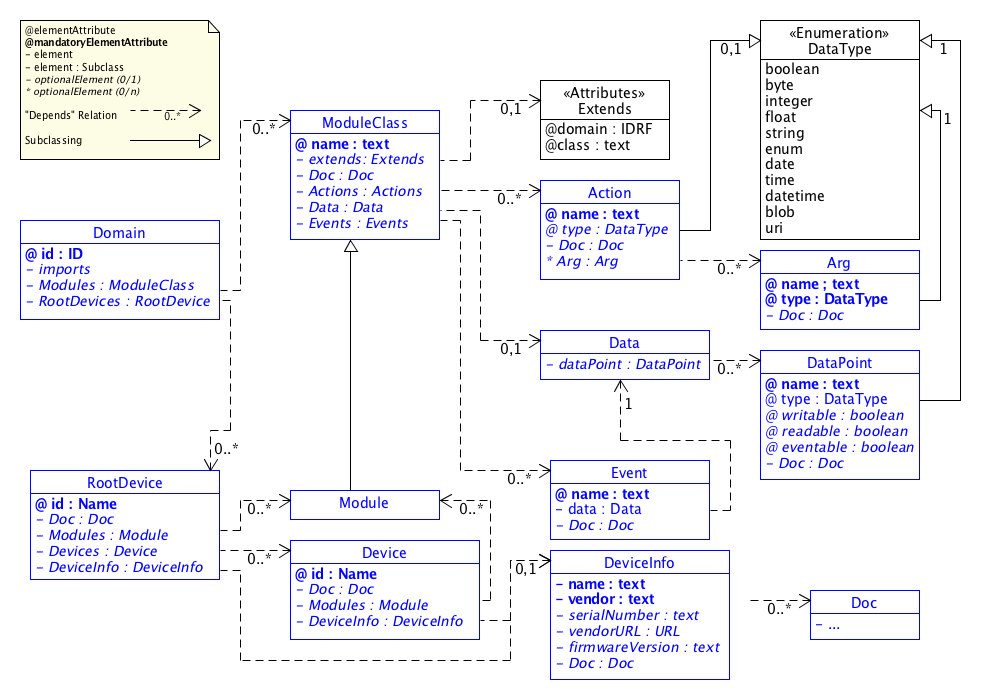

# SDT Components

In this document an overview about the SDT 2.0 ødefinitions and component hierarchy is given.

[Domain](#Domain)  
[RootDevice](#RootDevice)  
[Device](#Device)  
[DeviceInfo](#DeviceInfo)

## SDT Overview
The followng UML diagram presents an overview about the SDT components.

The syntax used in the diagram to model an XML Schema Definition (XSD) as an UML diagram follows the following approaches:

- [Design XML schemas using UML](http://www.ibm.com/developerworks/library/x-umlschem/)
- [UML For W3C XML Schema Design](http://www.xml.com/pub/a/2002/08/07/wxs_uml.html)

## Components

### Domain
The *Domain* is the top-level component that defines all modules and devices of a domain. A *Domain* can import definitions of other domains.

A *Domain* can define *ModuleClasses* or *RootDevices* only, or may choose to provide both.

#### Attributes
- **id** : The identifier for that *Domain*. Required.

#### Elements
- **Imports** : XML import/include of other XML files. Optional.
- **Modules** : A list of *Module* components that are global to the whole domain. Optional.
- **RootDevices** : a List *RootDevice* components. Optional.

#### Example

	<Domain xmlns:xi="http://www.w3.org/2001/XInclude"
    	xmlns="http://hgi.org/xml/dal/2.0" 
    	id="org.hgi">
    	<Imports>
      	  <xi:include href="./dal-core.xml" parse="xml" />
    	</Imports>
    	<Modules>
    		<!-- List of Domain global Modules go here -->
    	</Modules>
    	<RootDevices>
    		<!-- List of RootDevices go here -->
		</RootDevices>
	</Domain>

---

### RootDevice
A *RootDevice* is the description of a (physical) device that may contain optional sub-devices. It represents the idea an appliance that is addressable on a Home Area Network where one or more sub-*Devices* provide certain functionalities. 

An example is a connected power-strip where each of the sockets can be switched on and off individually. The power-strip itself can provide functions such as "all sockets off" and "overall power consumption".

If the *RootDevice* includes sub-*Devices* then each sub-device may be of the same type or of different types. The functionality (*Actions*) of the *RootDevice* may be different from the functionality of its sub-*Devices*.

If the *RootDevice* does not include sub-devices then the *RootDevice* is the actual adressable device that provides all the functionality of the connected appliance.

*RootDevices* may define their own *ModuleClasses* or refer to predefined ModulesClasses of its or another *Domain*.

#### Attributes
- **id** : The identifier for that *RootDevice*. Required.

#### Elements

- **Doc** : Documentation for the *RootDevice*. Optional.
- **Modules** : A list of *Module* components that are local to the *RootDevice*. Optional.
- **DeviceInfo** : Further meta-data about the *RootDevice*. Optional.
- **Devices** : A list *Device* components. Optional.

#### Example

	<RootDevice id="aRootDevice">
		<Doc>Some documentation</Doc>
		<Modules>
			<!-- List of Modules local to the RootDevice go here-->
		</Modules>
		<DeviceInfo>
			<!-- The DeviceInfos for the RootDevice goes here-->
		</DeviceInfo>
		<Devices>
			<!-- List of Sub-Devices of the RootDevice go here-->
		</Devices>
	</RootDevice>

---

### Device
*Devices* are optional components of a *RootDevice*. They represent physical sub-devices inside another device (the *RootDevice*).

*Devices* may define their own *ModuleClasses* or refer to predefined ModulesClasses of its or another *Domain*.

#### Attributes
- **id** : The identifier for that *Device*. Required.

#### Elements
- **Doc** : Documentation for the *Device*. Optional.
- **Modules** : A list of *Module* components that are local to the *RootDevice*. Optional.
- **DeviceInfo** : A list *Device* components. Optional.

#### Example

	<Device id="aDevice">
		<Doc>Some documentation</Doc>
		<Modules>
			<!-- Modules local to the Device go here-->
		</Modules>
		<DeviceInfo>
			<!-- The DeviceInfo for the Device goes here-->
		</DeviceInfo>
	</RootDevice>

---

### Module, ModuleClass, ModuleDef

#### Attributes
#### Sub-Components
#### Example

---

### DeviceInfo
The *DeviceInfo* is an element of *RootDevice* or *Device* where a device vendor can provide metadata for a device that may be presented to an end-user.

#### Attributes
None.

#### Elements
- **Name** : Vendor-specific name of a device. Required.
- **Vendor** : Name of the vendor for the device. Required.
- **FirmwareVersion** : Current version number of the firmware or other version information. Optional.
- **VendorURL** : A URL that points to further information for that device. This might be the product page on the web or an URL to the device manual. Optional.
- **SerialNumber** : The serial number or serial string. Optional.

#### Example
	
	<DeviceInfo>
		<Name>SomeDeviceName</Name>
		<Vendor>ACME</Vendor>
		<FirmwareVersion>1.0</FirmwareVersion>
		<VendorURL>http://www.example.com/</VendorURL>
		<SerialNumber>1234.5</SerialNumber>
	</DeviceInfo>

---

---

### Action

### Data
#### DataPoint

### Event

# DOC TBD
Explain. Describe content elements

