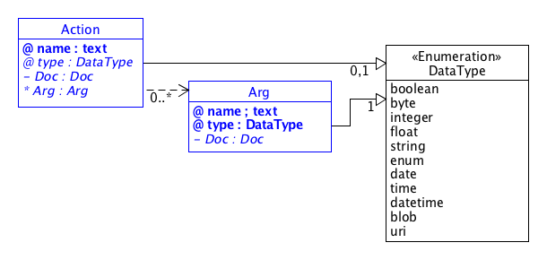
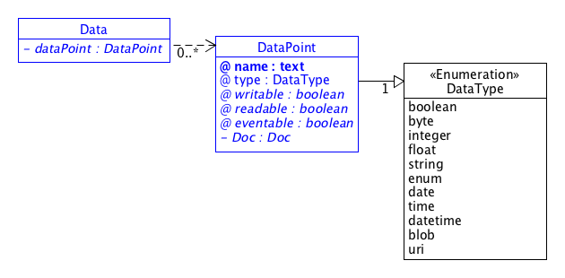

# SDT Components

In this document an overview about the SDT 2.0 definitions and component hierarchy is given.

## Contents

[Domain](#Domain)  
[RootDevice](#RootDevice) | [Device](#Device)  
&nbsp;&nbsp;&nbsp;[DeviceInfo](#DeviceInfo)  
[ModuleClass](#ModuleClass)  
&nbsp;&nbsp;&nbsp;[Action](#Action)  
&nbsp;&nbsp;&nbsp;[Data](#Data)  
&nbsp;&nbsp;&nbsp;&nbsp;&nbsp;&nbsp;[DataType](#DataType)  
&nbsp;&nbsp;&nbsp;[Event](#Event) 

## SDT Overview
The followng UML diagram presents an overview about the SDT components.

The syntax used in the diagram to model an XML Schema Definition (XSD) as an UML diagram follows the following approaches:

- [Design XML schemas using UML](http://www.ibm.com/developerworks/library/x-umlschem/)
- [UML For W3C XML Schema Design](http://www.xml.com/pub/a/2002/08/07/wxs_uml.html)

## Components

### Domain
The *Domain* is the top-level component that defines all modules and devices of a domain. A *Domain* can import definitions of other domains.

A *Domain* can define *ModuleClasses* or *RootDevices* only, or may choose to provide both.

#### Attributes
- **id** : The identifier for that *Domain*. Required.

#### Elements
- **Imports** : XML import/include of other XML files. Optional.
- **Modules** : A list of *Module* components that are global to the whole domain. Optional.
- **RootDevices** : a List *RootDevice* components. Optional.

#### Example

	<Domain xmlns:xi="http://www.w3.org/2001/XInclude"
    	xmlns="http://hgi.org/xml/dal/2.0" 
    	id="org.hgi">
    	<Imports>
      	  <xi:include href="./dal-core.xml" parse="xml" />
    	</Imports>
    	<Modules>
    		<!-- List of Domain global Modules goes here -->
    	</Modules>
    	<RootDevices>
    		<!-- List of RootDevices goes here -->
		</RootDevices>
	</Domain>

---

### RootDevice
A *RootDevice* is the description of a (physical) device that may contain optional embedded sub-devices. It represents the idea an appliance that is addressable on a Home Area Network where one or more sub-*Devices* provide certain functionalities. 

An example is a connected power-strip where each of the sockets can be switched on and off individually. The power-strip itself can provide functions such as "all sockets off" and "overall power consumption".

If the *RootDevice* includes sub-*Devices* then each sub-device may be of the same type or of different types. The functionality (*Actions*) of the *RootDevice* may be different from the functionality of its sub-*Devices*.

If the *RootDevice* does not include sub-devices then the *RootDevice* is the actual adressable device that provides all the functionality of the connected appliance.

*RootDevices* may define their own *ModuleClasses* or refer to predefined ModulesClasses of its or another *Domain*.

#### Attributes
- **id** : The identifier for that *RootDevice*. Required.

#### Elements

- **Doc** : Documentation for the *RootDevice*. Optional.
- **Modules** : A list of *Module* components that are local to the *RootDevice*. Optional.
- **DeviceInfo** : Further meta-data about the *RootDevice*. Optional.
- **Devices** : A list *Device* components. Optional.

#### Example

	<RootDevice id="aRootDevice">
		<Doc>Some documentation</Doc>
		<Modules>
			<!-- List of Modules local to the RootDevice goes here-->
		</Modules>
		<DeviceInfo>
			<!-- The DeviceInfos for the RootDevice goes here-->
		</DeviceInfo>
		<Devices>
			<!-- List of Sub-Devices of the RootDevice goes here-->
		</Devices>
	</RootDevice>

---

### Device
*Devices* are optional components of a *RootDevice*. They represent physical sub-devices inside another device (the *RootDevice*).

*Devices* may define their own *ModuleClasses* or refer to predefined ModulesClasses of its or another *Domain*.

#### Attributes
- **id** : The identifier for that *Device*. Required.

#### Elements
- **Doc** : Documentation for the *Device*. Optional.
- **Modules** : A list of *Module* components that are local to the *RootDevice*. Optional.
- **DeviceInfo** : A list *Device* components. Optional.

#### Example

	<Device id="aDevice">
		<Doc>Some documentation</Doc>
		<Modules>
			<!-- List of Modules local to the Device goes here-->
		</Modules>
		<DeviceInfo>
			<!-- The DeviceInfo for the Device goes here-->
		</DeviceInfo>
	</RootDevice>

---

### DeviceInfo
The *DeviceInfo* is an element of *RootDevice* or *Device* where a device vendor can provide metadata for a device that may be presented to an end-user.

#### Attributes
None.

#### Elements
- **Name** : Vendor-specific name of a device. Required.
- **Vendor** : Name of the vendor for the device. Required.
- **FirmwareVersion** : Current version number of the firmware or other version information. Optional.
- **VendorURL** : A URL that points to further information for that device. This might be the product page on the web or an URL to the device manual. Optional.
- **SerialNumber** : The serial number or serial string. Optional.

#### Example
	
	<DeviceInfo>
		<Name>SomeDeviceName</Name>
		<Vendor>ACME</Vendor>
		<FirmwareVersion>1.0</FirmwareVersion>
		<VendorURL>http://www.example.com/</VendorURL>
		<SerialNumber>1234.5</SerialNumber>
	</DeviceInfo>

---

### Module, ModuleClass
The *Module* (or *ModuleClass*) represents the concept of a reusable module that defines the *Actions*, *Data* and *Events* for a single functionality of a device. A connected device may contain or refer to single or multiple *ModuleClasses* to specify its inherent services it exposes for use by applications.

*ModuleClasses* can be defined by a domain (on the level of the *Domain* component) or in *(Root)Devices*: The former are global to a domain and can be used by all *(Root)Devices* of a *Domain*; the later are local to the *Device*. *ModuleClasses* defined on the *Domain* level can be imported and used by other *Domains*.

New *ModuleClasses* can be defined by extending existing *ModuleClasses* to add new or overriding defined *Actions*, *Data* and *Events*.

#### Attributes
- **Name** : Name of the *ModuleClass*. Required.

#### Elements
- **extends** : Reference to a another *ModuleClass* that is extended with this *ModuleClass*. Optional.  
The element has the following attributes:
	- **domain** : Identifier / Reference of the *Domain* of the extended *ModuleClass*. Required when *extends* is specified.
	- **class** : Name of the *ModuleClass* in the *Domain* thet is extended.
- **Doc** : Documentation for the *ModuleClass*. Optional.
- **Actions** : A list of *Action* components, each defining a single action. Optional.
- **Data** : A list of *Data* components. Optional.
- **Events** : A list of *Event* components. Optional.

#### Example

	<ModuleClass name="BooleanState">
		<Doc>Some documentation</Doc>
		<Actions>
			<!-- List of Actions goes here-->
		</Actions>
		<Events>
			<!-- List of Events goes here-->
		</Events
		<Data>
			<!-- List of DataPoints goes here-->
		</Data>
	</ModuleClass>

---

### Action
An *Action* is defines a single procedure call for a *ModuleClass*. It is basically for calling a function on a physical device in order to set or request data, or to invoke an action at a *Device*.

#### Attributes
- **name** : The name of the *Action*. Required.
- **type** : The return type of the *Action*. It must comply to one of the defined *DataTypes*. Optional. If no *type* is specified the *Action* does not return a value.

#### Elements
- **Doc** : Documentation for the *Action*. Optional.
- **Arg** : Zero or more occurances of argument definitions for an *Action*. Optional.  
The *Arg* has the following attributes and elements:
	- **name** : The name of the *Arg*. Attribute. Required.
	- **type** : The type of the *Arg*. It must comply to one of the defined *DataTypes*. Attribute. Required.
	- **Doc** : Documentation for the *Arg*. Element. Optional.

#### Example
The following are two examples for actions implementing a getter and a setter for boolean values.

	<Action name="get" type="boolean">
		<Doc>Obtain the current associated state. Example of a getter.</Doc>
	</Action>

	<Action name="setTarget">
		<Doc>Set the associated state to the specified value. Example of a setter.</Doc>
		<Arg name="value" type="boolean">
    		<Doc>The desired value of the associated state.</Doc>
    	</Arg>
	</Action>

---

### Data
The *Data* component represents a list of *DataPoints*.

Though *DataPoints* only refer to single data points of a physical device it is possible to describe hierarchies by model the path to the data point in the hierarchy by a path-like structure like to the pathname of a UNIX file system. Here, the root node of the hierarchy is a slash (/ TODO hex value) and the nodes along the path are also separated by slashes. The actual datapoint is the last leaf at the path. 

In BNF:

	name := leaf | '/' path .
	path : = node '/' path | leaf.
	node := String . 
	leaf := String .
	String := [character string excluding the character '/'] .

#### Attributes
None.

#### Elements
- **DataPoint** : Zero or more occurances of *DataPoints. Optional.  
A *DataPoint* has the following attributes and elements:
	- **name** : The name (and possible path in a hierarchical data model) of the *DataPoint*. Attribute. Required.
	- **type** : The type of the *DataPoint*. It must comply to one of the defined *DataTypes*. Attribute. Required.
	- **writable** : Boolean value that indicates whether this *DataPoint* is writable by an application. Attribute. Optional. Default: false.
	- **readable** : Boolean value that indicates whether this *DataPoint* is readable by an application. Attribute. Optional. Default: false.
	- **eventable** : Boolean value that indicates whether an internal or external change of this *DataPoint* raises an event. Attribute. Optional. Default: false.
	- **Doc** : Documentation for the *DataPoint*. Element. Optional.

#### Example
	<Data>
		<DataPoint  name="attributeName" type="string" writable="false">
			<Doc>Some documentation for the DataPoint</Doc>
		</DataPoint>
	</Data>

---

### DataType
The following *DataTypes* can be used in the SDT's *Actions*, *Args* and *DataTypes* elements and attributes. If not stated otherwise datatypes should comply to the equivalent datatypes defined in [XML Schema Part 2: Datatypes Second Edition](http://www.w3.org/TR/xmlschema-2/#boolean):

- **boolean** : A boolean value as defined by [http://www.w3.org/TR/xmlschema-2/#boolean](http://www.w3.org/TR/xmlschema-2/#boolean) .
- **byte** : An integer datatype with the range of [0 - 255] as defined by [http://www.w3.org/TR/xmlschema-2/#unsignedByte](http://www.w3.org/TR/xmlschema-2/#unsignedByte) .
- **integer** : An integer value as defined by [http://www.w3.org/TR/xmlschema-2/#integer](http://www.w3.org/TR/xmlschema-2/#integer) .
- **float** : An IEEE single-precision 32-bit floating point type as defined by [http://www.w3.org/TR/xmlschema-2/#float](http://www.w3.org/TR/xmlschema-2/#float) .
- **string** : The string datatype represents character strings as defined by [http://www.w3.org/TR/xmlschema-2/#string](http://www.w3.org/TR/xmlschema-2/#string) .
- **enum** : A complete and orderd list of items in a collection. Items in an enumeration are separated by commas (, 0x2c) and must be of one of the datatypes defined here. Commas (, 0x2c) and backslashes (\ 0x5c) in enumaration items must be escaped by backslash.
- **date** : A date value as defined by [http://www.w3.org/TR/xmlschema-2/#date](http://www.w3.org/TR/xmlschema-2/#date) .
- **time** : A time value as defined by [http://www.w3.org/TR/xmlschema-2/#time](http://www.w3.org/TR/xmlschema-2/#time) .
- **datetime** : A time value as defined by [http://www.w3.org/TR/xmlschema-2/#dateTime](http://www.w3.org/TR/xmlschema-2/#dateTime) .
- **blob** : A blob value represents a binary object. The internal encoding is transparent and not defined here. The binary object must be encoded conforming to [http://www.w3.org/TR/xmlschema-2/#base64Binary](http://www.w3.org/TR/xmlschema-2/#base64Binary) .
- **uri** : A URI that represents a Uniform Resource Identifier Reference (URI) as defined by as defined by [RFC 2396](http://www.ietf.org/rfc/rfc2396.txt) and amended by [RFC 2732](http://www.ietf.org/rfc/rfc2732.txt) .

---

### Event
An *Event* is a component that defines properties for events that are raised as reactions to changes in *DataPoints* of a *device's* data model. These state changes can happen either through a device-internal change or by external means, e.g. a user operates a switch or the temperature in a room rises beyond a certain threshold.

#### Attributes
- **name** : The name of the *Event*. Required.

#### Elements
- **Data** : A list of *Data* components. Optional.

#### Example

TODO continue

# DOC TBD
Explain. Describe content elements

	DocText := [ text | emphasizedText | boldText | monotypeText ] * . 

	<define name="DocText">
		<zeroOrMore>
			<choice>
				<text/>
				<element name="em">
					<text/>
				</element>
				<element name="b">
					<text/>
				</element>
				<element name="tt">
					<text/>
				</element>
			</choice>
		</zeroOrMore>
	</define>

	<define name="Doc">
		<optional>
			<element name="Doc">
				<choice>
					<ref name="DocText"/>
					<zeroOrMore>
						<choice>
							<element name="p">
								<ref name="DocText"/>
							</element>
							<element name="img">
								<attribute name="src"/>
								<element name="caption">
									<text/>
								</element>
							</element>
						</choice>
					</zeroOrMore>
				</choice>
			</element>
		</optional>
	</define>

