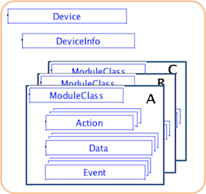
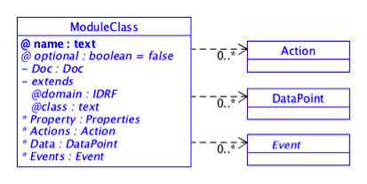

# Introduction to the SDT

The SDT (Smart Device Template) is an initiative from HGI to find consensus amongst various SDOs and industry alliances to derive a common approach for device modelling. HGI and partners have the approach to agree on a set of automation commands, following a common syntax, which are sufficient to model most home appliance functions.

At the time of writing, every software developed for home gateways or internet-of-things gateways needs to be capable of using various different protocols (ZigBee, UPnP, EchonetLite, DECT ULE, etc) to interact with a range of devices designed for the home environment. This adds extreme overheads in integrating, checking and updating code. The purpose of SDT is to describe devices and device services in a way which is independent of the LAN technology, in a format which is convenient and reliable for integration in modern code (Java, C/C++, ...).

The key goals of the SDT are: (1) keep it simple, especially for manufacturers to contribute device information; (2) modularity for functions and device types; (3) make it easy for developers to create unified APIs; (4) be independent of underlying home-area network technologies; (4) enable extendibility of the system in place without service interruption; (5) allow a pass-through mechanism to enable use of proprietary or technology-specific functions.

In general a description of device (or complex appliance) behaviour can be made in many ways, with various kinds of constraints:

1. no constraints (e.g. using OWL 2.0 or even more "flexibly" RDF)
2. moderate constraints (e.g. using XML and a related extensible XSD template)
3. strict constraints (typical for a device certified to interoperate with a specific LAN protocol)

HGI chose to use the approach "moderate constraints" (XSD based) because for software development it offers ease of use and a good compromise. In particular, if there are few or no constraints on control parameters then few automatic checks can be made to detect if the software parameters are appropriate for each device integrated. XML and XSD languages were chosen because they are familiar to many developers, can be parsed with common software tools, and can still be created and interpreted by humans if necessary.

HGI believes that Device information models based on XML and extensible XSD need some guidelines. If every possible feature of every existing LAN technology and appliance were allowed to be described in any formally correct way, then the results would be a modern Babel, no better than today's system of widely different and wildly competing automation protocols. 

Therefore HGI proposes to recommend a certain structure (template) for the information model(s), but to allow extensions. Naturally, the more industry consensus is achieved for a single recommended template, the greater the utility for software developers (and users).

The  SDT approach is to define re-usable basic functions (or services), labelled "ModuleClass" in the figure below, which can represent the typical functions found in many home automation systems, such as "on/off", "dim a lamp", "receive events from binary sensor", "read data from sensor", etc. Each ModuleClass is composed of a (small) number of actions, datapoint read/write operations, or asynchronous events. For example, an "on/off" ModuleClass would consist perhaps of just one Action, but a "ReadKeypad" Action might have a number of possible events, each with some data value and (usually) a sequence-ID or timestamp start/stop to indicate when and how long each key was pressed.
 

  
**SmartHome Device Template (XSD) for a generic device (simplification)**

The  SDT represents the device models introduced in the above figure by using an XSD schema to allow formal checking of compliance for XML device descriptions of specific appliances. The modularity  goal  in the XSD schema is achieved with  re-usable XSD fragments ("ModuleClass" in the figure). 

Complex devices or appliances can then be described by an appropriate set or collection of the agreed XSD fragments (ModuleClasses), as indicated in the figure, which also shows an optional DeviceInfo XSD fragment to allow noting of static information such as device manufacturer name, device firmware version, etc etc.

HGI has discussed with many SDOs to validate these concepts. SDT is designed to take into account the list of "services" compiled by the SAREF project (https://sites.google.com/site/smartappliancesproject/home).

The SDT supports the use of a set of templates for generic devices or appliances (e.g. for a dimmable lamp, a basic washing machine, etc, which would be specific instances of the "Device" object , which form the basis of APIs used by application developers. These templates can also be referenced by manufacturers creating XML documents to describe their specific products. For example, the SDT enables specification of a generic washing machine template, with on/off, set-wash-temperature, pause and a few other commands, which could be referenced by a manufacturer as the schema for a XML description of a basic model washing machine. The SDT allows for vendor-specific additional commands (ModuleClasses) to suit specific product types. 

The interoperability benefits can potentially partially obtain even without a fully complete interoperability of the SDT. For example, the most common functions can be modeled with SDT, and more particular functions can be modeled with technology-specific, proprietary, or seldom-used aspects. 

Various details about the recommended structure for SDTs are described in the next sections. The key point to keep in mind is that HGI sought a compromise between, at the one extreme, complete flexibility (which could describe any device, of any complexity) and, at the other extreme, a rigid structure which could be 100% validated and lead to validated software APIs.

## Definitions

This section provides an overview about the SDT 3.0 definitions and element hierarchy. Terms to be described in detail in this section are:

| Term |  Definition  |
|------|------------|
|Domain | Unique name, or "wrapper" which acts like a namespace, set by the organization creating the SDT, allowing reference to a package of definitions for the contained ModuleClasses and device definitions. Can be referenced when extending ModuleClasses. It has two possible uses: to select the scope of a technology domain, or to set the scope of a use case domain (like Home, SmartGrid, etc) |
| Device | Physical, addressable, identifiable appliance/sensor/actuator. |
| Sub-Device | A device (usually one of several) which may be embedded in a Device and/or is addressed via another Device. |
| ModuleClass | Specification of a single service with one or more service methods, the involved abstracted data model and related events. The expectation is that each separate service which may be used in many kinds of Devices (like PowerON/OFF, Open/Close, ...) will be described by a ModuleClass which can be re-used in many Device definitions. |
| Module | Instantiation of a ModuleClass for a specific Device or SubDevice|

**Definitions of SDT Elements.**

A major decision, facilitating validation of code and signalling, was to describe services (functionality) of devices in terms of ModuleClasses made up of combinations of three kinds of elements:

1. DataPoints which are aspects of the Device that can be read/written,
2. Actions which consist of more complex sequences of operations;
3. Events which can be signalled ("published") by devices asynchronously. 

This ModuleClass structure is shown in the figure below and is a major part of the SDT which is illustrated in detail in the following figure:
 
  
**UML description of device functionality in terms of Actions, DataPoints and Events**

## How should SDT work?

The basic concept is that a manufacturer, organisation or global SDO would define its preferred Smart Device Template, in XML, specified by and based on an XSD. Using that XSD, manufacturers or indeed hobbyists could "describe" existing or new devices by means of XML files, specifying the capabilities and the parameters needed to control the devices.

Assuming that the XML files conform to the specified XSD and to some guidelines described in this document, software developers could readily create APIs able to "parse" the XML-descriptions of devices and (assuming the underlying LAN technology of the device is supported by the software/hardware environment in the gateway) operate the equipment.

The key to making software reliably interoperate with various technologies is to define in the SDT a finite and convenient to use number of functions (which is the decision of the SDO which are commonly used and can therefore be reliably re-used in software for one type of device or another.

For the convenience of users and developers, it would also be possible to collect the device descriptions of common "modules" (types of) appliances so that the operations of "a generic air-conditioner" could be agreed and re-used often, adapting descriptions of special models with just some special features added as local extensions. Agreeing on the definition of "a generic XYZ appliance" is rather time-consuming, so such "repository" may not become standardised, however the basic approach has huge benefits even if such an archive (also known as a "hierarchical ontology") is never formally agreed.

## Related aspects which are out of scope of the SDT

The SDT defines the structure of all compliant XML descriptions. Each XML description of a specific device is definable at the time of manufacture of the device and can therefore only contain "static" information: (a) manufacturer data in the form of documentation elements and properties, (b) device capability information detailing the firmware operations and types/meanings of input/output variables. 

NOT directly part of this work is a related but separate aspect of every gateway software development: a "device abstraction layer" which can translate between (1) software APIs written based on a particular SDT and (2) the "commands" expected by several different LAN protocols and their hardware controllers. 

Programmers developing a "device abstraction layer" for software in a gateway need to create run-time representations of all the recognized devices, their operations and their actual states. This internal "information model" needs to be updated in real time as the devices and the users interact. Programmers may be tempted to use the SDT structure to organize their real-time information model, adding additional information elements for the current state of each device, for some kind of "history" of commands sent/acknowledged, the user etc. 

The above is an efficient approach BUT it must be clear that the real-time state information and history of events, etc, can NOT be represented in a pre-defined SDT and in the XML giving specific details for a device.

---

Click [here](SDT_Components.md) for detailed documentation about SDT.

