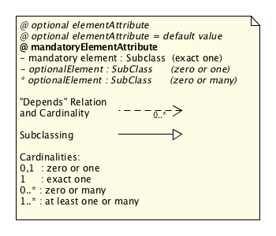
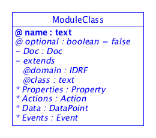
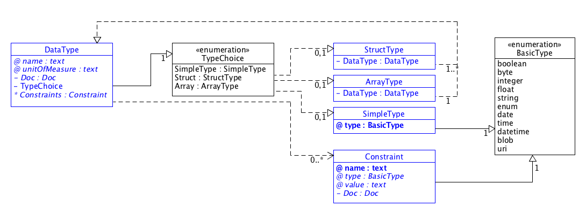

# SDT Components

[Domain](#Domain)  
[Device](#Device) | [SubDevice](#SubDevice)  
[Property](#Property)  
[Module and ModuleClass](#ModuleClass)  
   [Action](#Action)  
      [Arg](#Arg)  
   [DataPoint](#DataPoint)  
   [Event](#Event)  
[Data Types](#Data_Types)  
   [DataType](#DataType)  
   [Constraint](#Constraint)  
   [SimpleType](#SimpleType)  
   [StructType](#StructType)  
   [ArrayType](#ArrayType)  
[Doc](#Documentation)  

---

## SDT Overview

The following UML diagram presents an overview of the structure (elements) of every SDT which is conformant with these guidelines. As implied in the above descriptions, there can be many different choices of the details of a SDT, each one optimized for a particular market segment and the types of devices used in that market segment. Obviously an unnecessary proliferation is counter-productive, but as long as each SDT conforms to the structure shown below then it will be possible with little or modest effort for software to be adapted accordingly. 

The key to the diagram elements of the UML diagrams above and the snippets in the following sections:

The syntax used in the diagram to model an XML Schema Definition (XSD) as an UML diagram follows the following approaches:

- [Design XML schemas using UML](http://www.ibm.com/developerworks/library/x-umlschem/)
- [UML For W3C XML Schema Design](http://www.xml.com/pub/a/2002/08/07/wxs_uml.html)

### Domain

The *Domain* element allows labeling of different SDT templates for different technologies and/or industry segments ("verticals"): for example eHealth and Building Management might prefer quite different detailed structures/templates. This also helps keep information in human-friendly and manageable blocks. It is assumed that there will be multiple "SDT Templates" and some of them may be completely proprietary.

It can also be used to collect all specified [ModuleClasses](#ModuleClasses)
 and [Devices](#Devices) in one referencable logical group.

#### Attributes
- **id** : The identifier for that *Domain*. Required.

#### Elements
- **[Doc](#Documentation)** : Documentation for the *Domain*. Optional.
- **Imports** : XML import/include of other XML files. Optional.
- **[Module](#ModuleClass)** : A list of those *Module* components that are global to the whole domain. Optional.
- **[Devices](#Device)** : a List of *Devices* components. Optional.

#### Example

	<Domain xmlns:xi="http://www.w3.org/2001/XInclude"
    	xmlns="http://homegatewayinitiative.org/xml/dal/3.0" 
    	id="org.homegatewayinitiative">
		<Doc>Some documentation</Doc>
    	<Imports>
    		<!-- Import other SDTs via XInclude's include mechanism -->
      		<xi:include href="./dal-core.xml" parse="xml" />
    	</Imports>
    	<Modules>
    		<!-- List of Domain global Modules goes here -->
    	</Modules>
    	<Devices>
    		<!-- List of Devices goes here -->
		</Devices>
	</Domain>

---

### Device

The *Device* was initially thought of as the representation of "the basic things we are trying to model" and can still be considered so. However, after discussion with various SDOs, it was decided to add also "[sub-devices](#SubDevice)". That is, there is one level of hierarchy to allow modeling of e.g. a set of independent energy monitoring plugs in a single addressable power-extension-block. (Other SDOs might consider it more appropriate to use a recursive sub-sub-sub ... device definition). Note that all the different devices which one needs to model within a Domain are composed of one or more [Modules](#ModuleClass). 

For each physical device on the network at least one *Device* **must** be defined. If the physical device is a simple device, i.e. it does not contain embedded devices, e.g. a light switch, it does not include further [SubDevices](#SubDevices). On the other hand, if the physical is a compound device, i.e. it does contain embedded devices that can be addressed separately, the *Device* **should** contain [SubDevices](SubDevices) for each of the identifiable embedded devices.

An example for a compound device  is a connected power-strip where each of the sockets can be switched on and off individually. The power-strip itself can provide functions such as "all sockets off" and "overall power consumption".

*Devices* may define their own [ModuleClasses](#ModuleClass) or refer to predefined ModulesClasses of the same or another [Domain](Domain).

#### Attributes
- **id** : The identifier for that *Device*. The identifier must be unique at least in the scope of the domain, but the final scope is also influenced by implementing technologies. Required.

#### Elements

- **[Doc](#Documentation)** : Documentation for the *Device*. Optional.
- **[Properties](#Property)** : Further meta-data (or properties) about the *Device*. Optional.
- **[Modules](#ModuleClass)** : A list of *Module* components that are local to the *Device*. Optional.
- **[SubDevices](#SubDevice)** : A list of *SubDevice* components. Optional.

#### Example

	<Device id="aDevice">
		<Doc>Some documentation</Doc>
		<Properties>
			<!-- The list of Properties for the Device goes here-->
		</Properties>
		<Modules>
			<!-- List of Modules local to the Device goes here-->
		</Modules>
		<SubDevices>
			<!-- List of Sub-Devices of the Device goes here-->
		</SubDevices>
	</Device>

---

### SubDevice
*SubDevices* are optional components of a [Device](#Device). They represent physical sub-devices and services inside another device (the *Device*).

*SubDevices* may define their own [ModuleClasses](#ModuleClass) or extend *ModuleClasses* of it's or another [Domain](#Domain).

#### Attributes
- **id** : The identifier for that *SubDevice*. The identifier must be unique at least in the scope of the domain, but the final scope is also influenced by implementing technologies. Required.

#### Elements
- **[Doc](#Documentation)** : Documentation for the *SubDevice*. Optional.
- **[Properties](#Property)** : Further meta-data (or properties) about the *SubDevice*. Optional.
- **[Modules](#ModuleClass)** : A list of *Module* components that are local to the *SubDevice*. Optional.

#### Example

	<SubDevice id="aSubDevice">
		<Doc>Some documentation</Doc>
		<Properties>
			<!-- The list of Properties for the Device goes here-->
		</Properties>
		<Modules>
			<!-- List of Modules local to the Device goes here-->
		</Modules>
	</SubDevice>

---

### Property : Element of a *Device* or *ModuleClass*

*Property* elements are used to append to [Devices](#Device) and their [ModuleClass](ModuleClass) elements with arbitrary additional information. For [Devices](#Device) it would be very common for a manufacturer to want to add into the XML file which is describing the device such information as "Manufacturing Site", "Date of Manufacture", "Certification Code", "Energy Label Code", "compatible LAN technology", "URL for the device handbook", "physical limits of operation environments", etc.

Some of that information might in some devices be available by reading a specific device [DataPoint](#DataPoint), however even if it cannot be read from the device then at least it can be noted in the device's XML description. Examples for organizations that specify these kind of added "Property" information are [eCl@ss](http://www.eclass.eu) and [UNSPSC](http://www.unspsc.org) (United Nations Standard Products and Services Code).

Since the *Properties* are highly varied, depending on industry segment, no attempt is made in the SDT to constrain the options: however it is highly recommended to provide software-developer-friendly information in the [Doc](#Documentation) field of each Property. 

#### Attributes
- **name**: Name or identifier of a *Property*.
- **optional**: Boolean that indicates whether a *Property* is optional or mandatory. Optional, the default is *false*.
- **value**: Text representation of value of a *Property*. Optional.

#### Elements
- **[Doc](#Documentation)** : Documentation for the *Property*. Optional.
- **DataType** : The data type of the property. This must be a [SimpleType](#SimpleType).

#### Example
	
	<Property name="ManufacturedDate" value="2015.10.30 10:06">
		<SimpleType type="datetime" />
	</Property>

---

### Module and ModuleClass

**Module**

*Module* elements are basically constraints or templates for how to model functionality of real things/appliances/devices within the [Domain](#Domain). There could be an infinite number of possible functionalities, however it is recommended to identify a not-too-large selection of them as generic examples (called *"*ModuleClasses*, see below) and allow for additional proprietary extensions. In a particular [Domain](#Domain) there will be one *Module* for each of the agreed *ModuleClasses* plus additional ones for each extension of a *ModuleClass*.

The advantage of identifying a subset of generic *ModuleClasses*, described below, is that any suitable high-level software would then be able to "parse" the generic functionality for all compliant appliances, even if the proprietary parts could not be interpreted by the software.

Every [Device](#Device) can then be described by a collection of *Modules* (functionality). In the simplest examples, where there are no extensions needed, each *ModuleClass* has exactly one "child" Module ... in such cases the software developer can consider the two terms to be the same.

The relationship between a *ModuleClass* and a *Module* is very similar to the specification of a class and an instantiated object in an object oriented programming language.

**ModuleClass**

The set of *ModuleClasses* is defined at the [Domain](#Domain) level. Each one describes some functionality (services). In principle there could be an infinite number of *ModuleClasses* (as noted above), for every kind of functionality found in UPnP, ZigBee and all the other automation protocols ... However that would not simplify the job of software developers at all! Therefore, HGI recommends that a finite and convenient number of prototypical *ModuleClasses* are re-used as much as possible (within a Domain at least). 

Typical *ModuleClasses* might be equivalent to "power ON/OFF", "Open/Close", "PanUP/DOWN", "ReadTemperature", etc. Those examples make it apparent that various read/write usage of parameters, invoking of actions and waiting for events might be needed in the different *ModuleClasses*, and a guideline for those structures is explained below.

#### Attributes
- **name** : Name of the *Module* or *ModuleClass*. The name must be unique in the scope of the [Domain](#Domain). Required.
- **optional**: Boolean that indicates whether a *Module* or *ModuleClass* is optional or mandatory. Optional, the default is *false*.

#### Elements

- **[Doc](#Documentation)** : Documentation for the *Module* or *ModuleClass*. Optional.
- **extends** : Reference to a another *ModuleClass* or *Module* which is extended with this *ModuleClass*. Optional.  
The element has the following attributes:
	- **domain** : Identifier / Reference of the [Domain](#Domain) of the extended *ModuleClass*. Required for this element.
	- **class** : Name of the *ModuleClass* in the [Domain](#Domain) that is extended. Required for this element.
- **[Properties](#Property)** : Further meta-data (or properties) about the *Module* or *ModuleClass*. Optional.
- **[Actions](#Action)** : A list of *Action* components, each defining a single action. Optional.
- **[Data](#DataPoint)** : A list of *DataPoint* components. Optional.
- **[Events](#Event)** : A list of *Event* components. Optional.

#### Example

	<ModuleClass name="BooleanState">
		<Doc>Some documentation</Doc>
		<Actions>
			<!-- List of Actions goes here-->
		</Actions>
		<Events>
			<!-- List of Events goes here-->
		</Events
		<Data>
			<!-- List of DataPoints goes here-->
		</Data>
	</ModuleClass>

---

### DataPoint : Element of *ModuleClass* and *Event*

A *DataPoint* element represents an aspect of a device which can be read/written to, and forms part of a device’s data model. Manipulating *DataPoints* is the most common way of controlling devices. Each *DataPoint* has an associated *type* (e.g. simple integer/real numbers, string of text, struct, or arrays thereof) which facillitates data integrity. Note that all RESTful systems (e.g. CoAP) use only *DataPoint* operations, so the mapping of a data models using an SDT into RESTful applications is easy.

However, *DataPoints* are not the only way of controlling devices, so further [Actions](#Action) and [Events](#Event) are described below.

Though *DataPoints* only refer to single data points of a physical device it is possible to describe hierarchies by model the path to the data point in the hierarchy by a path-like structure like to the pathname of a UNIX file system. Here, the root node of the hierarchy is a slash (/ 0x2F) and the segments or nodes along the path are also separated by slashes. The actual datapoint is the last leaf at the path. 

In EBNF:

	name          = dataPointName | "/" path ;  
	path          = segment "/" path | dataPointName ;  
	segment       = string ;  
	dataPointName = string ;  
	string        = (* character string excluding the character "/" *) ;

#### Attributes
- **name** : The name (and possible path in a hierarchical data model) of the *DataPoint*. The name must be unique in the scope of the [ModuleClass](#ModuleClass). Required.
- **optional**: Boolean that indicates whether a *DataPoint* is optional or mandatory. Optional, the default is *false*.
- **writable** : Boolean value that indicates whether this *DataPoint* is writable by an application. Optional. Default: true.
- **readable** : Boolean value that indicates whether this *DataPoint* is readable by an application. Optional. Default: true.
- **eventable** : Boolean value that indicates whether an internal or external change of this *DataPoint* raises an event. Optional. Default: false.

#### Elements
- **[Doc](#Documentation)** : Documentation for the *DataPoint*. Optional.
- **[DataType](#DataType)** : The type of the *DataPoint*. It must comply to the *DataType* definition. Required.

#### Example

	<Data>
		<DataPoint  name="attributeName" writable="false">
			<Doc>Some documentation for the DataPoint</Doc>
			<DataType>
				<SimpleType type="string" />
			</DataType
		</DataPoint>
	</Data>

---

### Action : Element of *ModuleClass*

*Action* elements are an efficient way of describing arbitrary sequences of operations/methods; these are very common in automation. Typical example include "FactoryReset", and "AutoCalibrate". *Actions* preserve transaction integrity by putting together all the parameters ("args", see next section) with the method which checks and executes them, in one step.

Note that systems which rely on RESTful operations need to carry out such complex setup-parameters-then-do-action by first using (several) [DataPoint](#DataPoint) operations to "load" the parameters to the device and then do a [DataPoint](#DataPoint) operation to manipulate the "start operation NOW" action.

#### Attributes
- **name** : The name of the *Action*. The name must be unique in the scope of the [ModuleClass](#ModuleClass). Required.
- **optional**: Boolean that indicates whether an *Action* is optional or mandatory. Optional, the default is *false*.

#### Elements
- **[Doc](#Documentation)** : Documentation for the *Action*. Optional.
- **[DataType](#DataType)** : The return type of the *Action*. It must comply to the *DataType* definition. Optional. If no *DataType* is specified the *Action* does not return a value.
- **Args** : Zero or more occurances of [argument](#Arg) definitions for an *Action*. Optional.

#### Example
The following are two examples for actions implementing a getter and a setter for boolean values.

	<Action name="get" type="boolean">
		<Doc>Obtain the current associated state. Example of a getter.</Doc>
	</Action>

	<Action name="setTarget">
		<Doc>Set the associated state to the specified value. Example of a setter.</Doc>
		<Args>
			<Arg name="value">
	    		<Doc>The desired value of the associated state.</Doc>
	    		<DataType>
	    			<SimpleType type="boolean" />
	    		</DataType>
	    	</Arg>
	    </Args>
	</Action>

---

### Event : Element of *ModuleClass*

*Event* elements are needed for automation protocols which "push" information, instead of relying on polling by the software application. A typical example would be a "SensorAlert" where a window sensor immediately transmits a change of its state from "closed" to "open", which could be used in a burglar alarm application, needs to be ready to accept such information immediately, and not wait for a regular polling of the device.

#### Attributes
- **name** : The name of the *Event*. The name must be unique in the scope of the [ModuleClass](#ModuleClass). Required.
- **optional**: Boolean that indicates whether an *Event* is optional or mandatory. Optional, the default is *false*.

#### Elements
- **[Doc](#Documentation)** : Documentation for the *Event* Element. Optional.
- **[Data](#DataPoint)** : A list of *DataPoint* components for an event's payload. Optional.

#### Example

	<Event name="stateChanged">
		<Doc>Some documentation for the Event</Doc>
		<Data>
			<DataPoint name="state">
				<DataType>
					<SimpleType type="boolean" />
				</DataType>
			</DataPoint>
		</Data>
	</Event>

---

### Arg : Element of *Action*

 
The *Arg* element represents the parameter information which a device needs to carry out a required *Action*. 

The *Arg* has the following attributes and elements:

#### Attributes
- **name** : The name of the *Arg* attribute. Required.

#### Elements
- **[Doc](#Documentation)** : Documentation for the *argument*. Optional.
- **[DataType](#DataType)** : The return type of the *argument*. It must comply to the *DataType* definition. Required.

#### Example
See [example above](#ActionExample).

---

### DataType
The data type can be simple integers or string text, or rather complex, as shown below:

The various elements are described in the sections below.

The *DataType* element is a "container" for the various aspects of a type. 

#### Attributes
- **name** : The name of the *DataType*. The name must be set for the [Struct](#Struct) types to distinguish individual fields in that structure. It can be used in other cases. Optional.
- **unitOfMeasure** : Before considering the type of data in detail, there is the option to label the data with the units of measurement.  A "Temperature" measurement is meaningless until the units Kelvin, Celcius, Fahrenheit etc are known. Because of the extreme variety of units, a string field is the default annotation method, although of course a SDO could decide to reference a standardized list of units. Optional.

#### Elements
- **[Doc](#Documentation)** : Documentation for the *DataType* Element. Optional.
- **TypeChoice** : This element is actual an element from the following list of data types:
	- **[SimpleType](#SimpleType)**
	- **[Struct](#StructType)**
	- **[Array](#ArrayType)**
- **[Constraint](#Constraint)** : A list of *Constraint* elements. Optional.

---

### Constraint : Element of DataType

The *Constraint* element is an optional element allowing the manufacturer to provide constraints on the permitted values of measured data or input parameters. It can significantly improve the reliability of software and validation of transmitted data.

#### Attributes
- **name** : The name or ID that identifies the *Constraint*. Required.
- **type** : The basic data type of the constraint. Note that this may be different from the type of the [DataType](#DataType) that this *Constraint* is assigned to. For example, a *Constraint* that specifies a maximum length of a string is of type *integer*. Optional.
- **value** : A pre-assigned value for the constraint, for example the maximum number of characters in a string. Optional.

#### Elements
- **[Doc](#Documentation)** : Documentation for the *Cosntraint* Element. Optional.

---

### TypeChoice : Construct of *DataType*
 
 

The *TypeChoice* construct is required for syntactic reasons in the UML diagram and the choice from the enumerated list simply designates the complexity of the following DataType.

---

### SimpleType : Element of *TypeChoice*

The *SimpleType* element is required in order for software to understand the format of the associated data, e.g. are the bytes an integer or real value? The selection choosen by HGI is based on practical experience to include some specific types which are slightly more complex:

1. the (technically redundant) options of *date* and *time* - to avoid problems which can arise interpreting a *datetime* value; 
2. *url* because it is expected to become extremely common to provide links to other data sources; 
3. the "blob" type to represent binary data of arbitrary structure.

If not stated otherwise datatypes should comply to the equivalent datatypes defined in [XML Schema Part 2: Datatypes Second Edition](http://www.w3.org/TR/xmlschema-2/#boolean):

- **boolean** : A boolean value as defined in [http://www.w3.org/TR/xmlschema-2/#boolean](http://www.w3.org/TR/xmlschema-2/#boolean) .
- **byte** : An integer datatype with the range of [0 - 255] as defined in [http://www.w3.org/TR/xmlschema-2/#unsignedByte](http://www.w3.org/TR/xmlschema-2/#unsignedByte) .
- **integer** : An integer value as defined in [http://www.w3.org/TR/xmlschema-2/#integer](http://www.w3.org/TR/xmlschema-2/#integer) .
- **float** : An IEEE single-precision 32-bit floating point type as defined in [http://www.w3.org/TR/xmlschema-2/#float](http://www.w3.org/TR/xmlschema-2/#float) .
- **string** : The string datatype represents character strings as defined in [http://www.w3.org/TR/xmlschema-2/#string](http://www.w3.org/TR/xmlschema-2/#string) .
- **enum** : A complete and orderd list of items in a collection. Items in an enumeration are separated by commas (, 0x2c) and must be of one of the datatypes defined here. Commas (, 0x2c) and backslashes (\ 0x5c) in enumaration items must be escaped by backslash.
- **date** : A date value as defined in [http://www.w3.org/TR/xmlschema-2/#date](http://www.w3.org/TR/xmlschema-2/#date) .
- **time** : A time value as defined in [http://www.w3.org/TR/xmlschema-2/#time](http://www.w3.org/TR/xmlschema-2/#time) .
- **datetime** : A time value as defined in [http://www.w3.org/TR/xmlschema-2/#dateTime](http://www.w3.org/TR/xmlschema-2/#dateTime) .
- **blob** : A blob value represents a binary object. The internal encoding is transparent and not defined here. The binary object must be encoded conforming to [http://www.w3.org/TR/xmlschema-2/#base64Binary](http://www.w3.org/TR/xmlschema-2/#base64Binary) .
- **uri** : A URI that represents a Uniform Resource Identifier Reference (URI) as defined by as defined in [RFC 2396](http://www.ietf.org/rfc/rfc2396.txt) and amended in [RFC 2732](http://www.ietf.org/rfc/rfc2732.txt) .

---

### StructType : Element of *TypeChoice*

The *StructType* element can be used to represent an ordered list of diverse DataTypes, which are represented by the *name* attribute of each [DataType](#DataType), and can be used recursively. 

#### Elements
- **[DataType](#DataType)** : A list of DataTypes elements representing the elements of a structure.

---

### ArrayType : Element of *TypeChoice*

The *ArrayType* element is provided for defining lists of data; the definition is recursive so that multi-dimensional arrays can be described. Note that a Constraint can be used to provide limits on Array size.

#### Elements
- **[DataType](#DataType)** : A single DataType element that specifies the data type for the elements of the array.

---

### Doc : Element for all Documentation

*Doc* elements (optional for all the above Elements) are very important to help understand the software-readable information for specific devices and services. They contain the human-readable information. Many automation protocols describe every possible operation in a comprehensive specification, however SDT is designed to include the relevant information at the "point of use" for the software developer, inside the SDT (and XML files based on it).

The text inside the *Doc* element can be structure using a very limited subset of HTML elements. The possible structuring is defined in EBNF as follows:

	Doc            = "<Doc>" docContent "</Doc" ;
	docContent     = docText | { paragraph | image } ;
	docText        = { text | emphasizedText | boldText | monotypeText } ;
	emphasizedText = "<em>" text "</em>" ;
	boldText       = "<b>" text "</b>" ;
	monotypeText   = "<tt>" text "</tt>" ;
	paragraph      = "
" docText "
" ;
	image          = "" "<caption>" text "</caption>" "</img>" ;
	url            = "\"" (* valid URL *) "\"" ;
	text           = (* XML text element *) ;

The intended use for each element is:

- **emphasizedText** : Emphasize the included text, e.g. printing it in italics font.
- **boldText** : Print the included text in bold font.
- **monotypeText** : Print the included text in a monospaced fonttype, e.g. to emphasize source code.
- **paragraph** : Structure the text in paragraphs.
- **image** : Include an image in the text. The image is loaded from the specified URL and must include a caption text.

