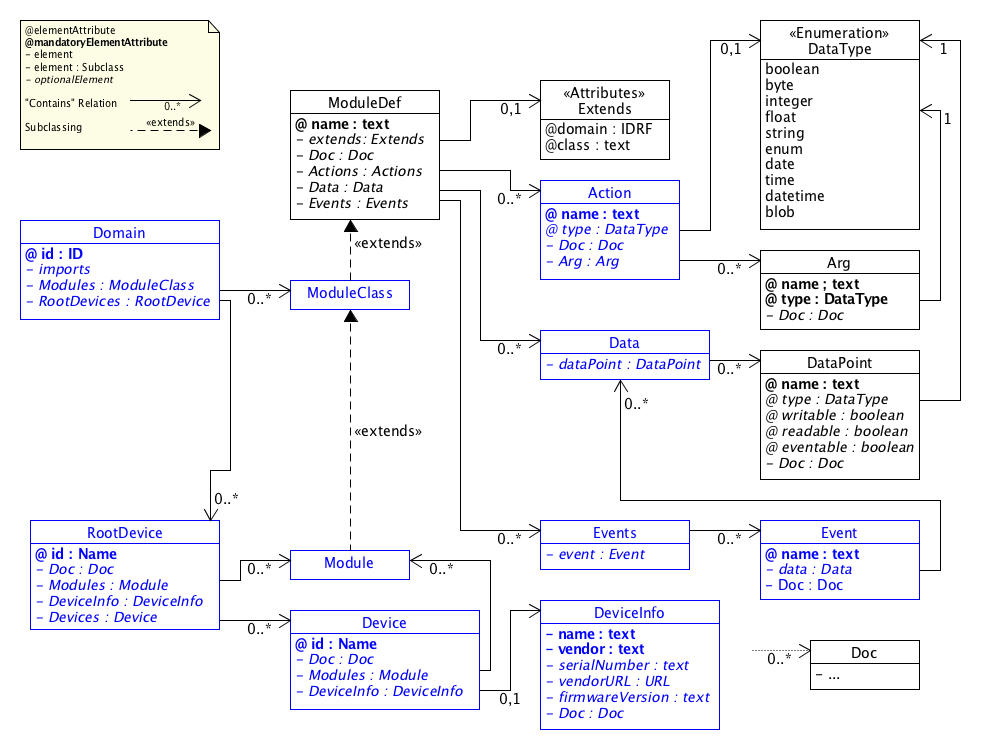

# SDT Components
In this document an overview about the SDT 2.0 ødefinitions and component hierarchy is given.

## SDT Overview
The followng UML diagram presents an overview about the SDT components.

The syntax used in the diagram to model an XML Schema Definition (XSD) as an UML diagram follows the following approaches:

- [Design XML schemas using UML](http://www.ibm.com/developerworks/library/x-umlschem/)
- [UML For W3C XML Schema Design](http://www.xml.com/pub/a/2002/08/07/wxs_uml.html)

## Components

### Domain

### RootDevice
#### DeviceInfo

### Device

### Module, ModuleClass, ModuleDef

### Action

### Data
#### DataPoint

### Event

